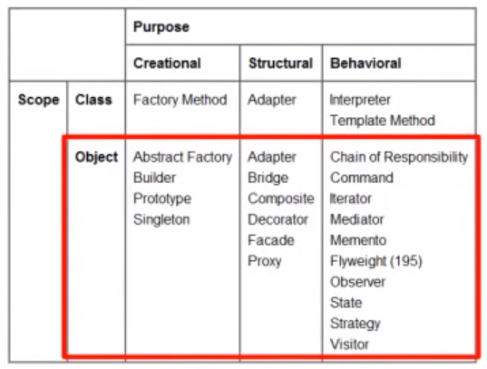
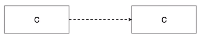
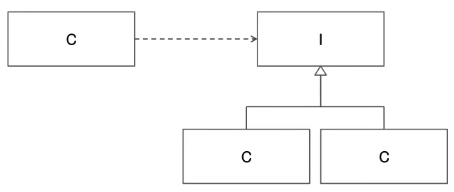
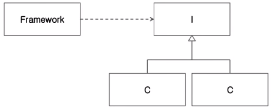

## 1회 - 재사용성과 다이나믹 디스패치, 더블 디스패치
# 스프링
Dependency + Injection + Framework

# Dependency ?
- 의존 관계(dependency relationship)  
  - Supplier의 변화가 Client에 영향을 주는 경우  

  - 의존 관계 발생
Supplier가 Client의 필드  
Supplier가 Client 메소드의 파라미터  
Supplier가 Client의 로컬 변수  
Supplier로 메시지를 보냄  
  - 클래스

 - 객체지향 설계/개발(재사용 가능하지 않음)
   - Client는 재사용이 어렵다
   - Client는 컴포넌트 / 서비스가 될 수 없다.

# Dependency !
오브젝트 패턴은 런타임시에 바뀔 수 있는, (상속 관계보다) 더 동적인 **오브젝트 (의존) 관계**를 다룬다  
-GoF

 - 컴파일 타임이 아니라 런타임시에 결정/구성되는 오브젝트 의존 관계  
    1. 구현 대신 인터페이스 사용  
    -클래스(구현) 의존 관계 제거  
    -클래스에 대한 의존성은 생성 패턴처럼 3자에게 위임
    2. 오브젝트 합성(composition)사용  
    -재사용성을 확보하기 위한 방법의 한 가지(상속의 대안)  
    -인터페이스 사용이 전제 (블랙 박스 재사용)  
    -새롭고 복잡한 기능을 얻기 위해서 오브젝트를 조합/합성  
    -런타임시에 다른 오브젝트에 대한 레퍼런스를 획득  
    -각 클래스가 캡슐화되고 자신의 역할에 충실하게 도와줌
- Inversion of Control
  - Designing **Reusable** Classes
  - Object Oriented 컨텍스트
  - 프레임워크 동작방식을 설명하는 용어
  - Design patterns
    - 클래스 스코프 : 화이트박스 프레임워크
    - 오브젝트 스코프 : 블랙박스 프레임워크
  - Callback/EnentDriven?

  # IoC
  Class Dependency
  
  
  Programming to Interface
  

  Object Composition
  
  
  Inversion of Control
  
  
  # 진행내용
  Dynamic Method Dispatch  
  Double Dispatch  
  Visitor Pattern  
  Visitor Proxy Pattern (Hibernate)

  Method Signature (name, parameter types) 

  Method Type (return type, method type parameter, method argument types, exception)  
  => Method Reference